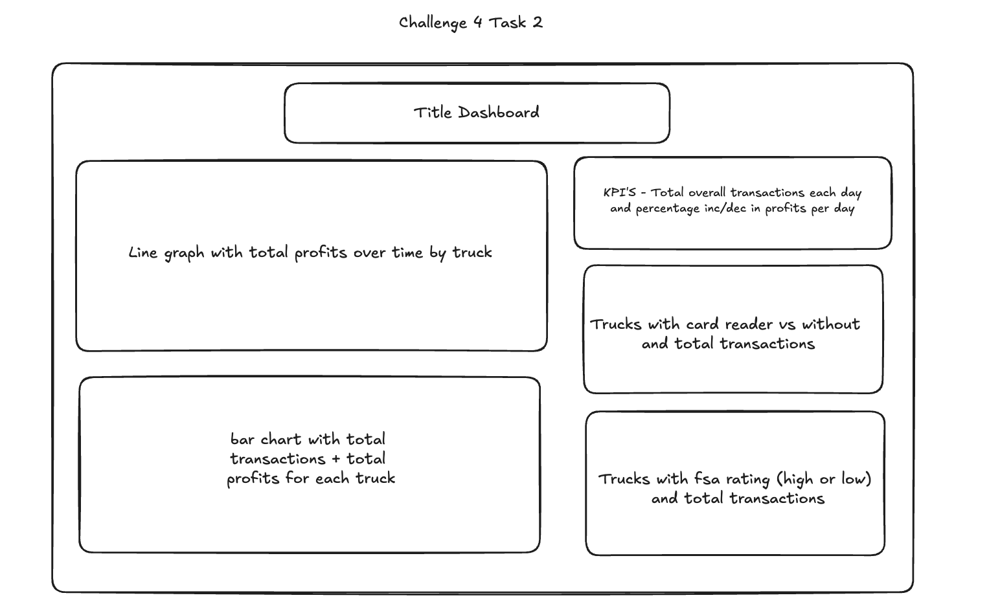

# Dashboard

This folder contains a Streamlit dashboard that loads data from the MySQL RDS using the PyMySQL module.

## Financial Dashboard - Locally

### Requirements

To install requirements run: `pip install -r requirements.txt`

A `.env` file must be created within this directory and contain the variables:

```
DB_HOST=<your_database_address>
DB_NAME=<your_database_name>
DB_USERNAME=<your_database_username>
DB_PASSWORD=<your_database_password>
DB_PORT=3306
```

### Get Started

The resulting dashboard can be seen by:

1. Installing the required dependencies to run the file by running `pip3 install -r requirements.txt` in a `.venv`

2. Then to view the dashboard, run the command `streamlit run financial_dashboard.py`


The wireframe for the dashboard:




